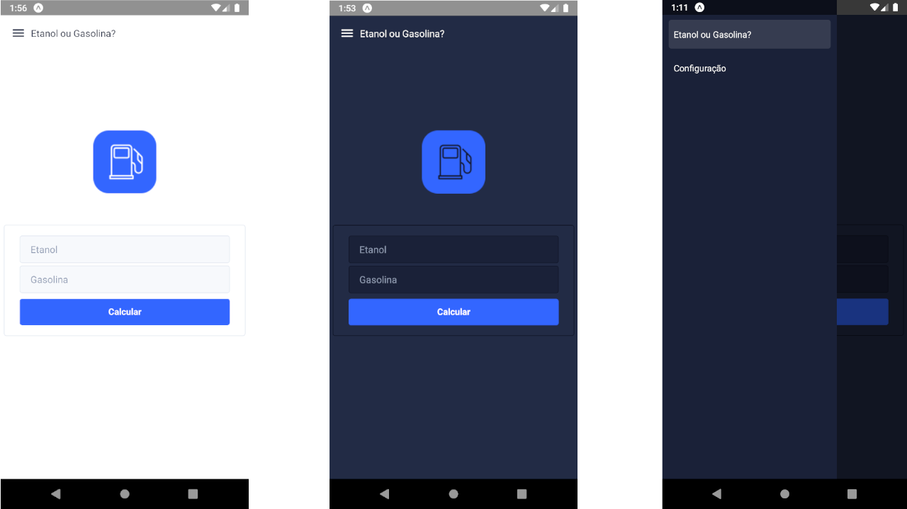

# Gasolina ou Etanol 
[Versão com TypeScript]

Aplicativo que compara qual o melhor custo benefico enter os combustiveos de etanol e gasolina



## Conteúdo

- [Demo](#demo)
- [Instalação](#instalação)
- [Modo de uso](#modo-de-uso)

## Demo

Foi feito o deploy para a plataforma do expo.io, teste lá:

 [https://expo.io/@gabrielborc/gasolina-ou-etanol-ts](https://expo.io/@gabrielborc/gasolina-ou-etanol-ts)


## Instalação

### Requisitos

- NodeJS(https://nodejs.org/pt-br/)
- Expo(https://expo.io/learn)

### Clone

Clone este repositório em sua máquina local usando `https://github.com/gabrielborc/gasolina_ou_etanol_ts`

### Configuração

Dentro da pasta raiz do projeto execute o comando abaixo para instalar as dependências:

```
$ expo install
```

## Modo de uso

Após seguir os passos de [instalação](#instalação) e [banco de dados], execute o projeto usando o comando abaixo na pasta raiz do projeto:

```
$ expo start
```

Agora será necessario instalar o aplicativo [expo](https://play.google.com/store/apps/details?id=host.exp.exponent&hl=pt_BR) no seu smartphone. Após instalar leia QR Code que apareceu no navegador quando executou o comando `$ expo start`